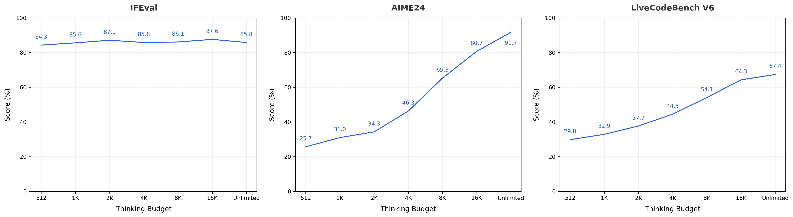

<div align="center">
 👋 Hi, everyone!
    <br>
    We are <b>ByteDance Seed Team.</b>
</div>

<p align="center">
  You can get to know us better through the following channels👇
  <br>
  <a href="https://seed.bytedance.com/">
    </a>
</p>


# Seed-OSS Open-Source Models
<p align="center">
  <a href="https://github.com/ByteDance-Seed/seed-oss">
    </a>
  <a href="https://github.com/ByteDance-Seed/seed-oss">
    </a>
  <a href="https://huggingface.co/ByteDance-Seed">
    </a>
  <br>
  <a href="./LICENSE">
    </a>
</p>

## News
- [2025/08/20]🔥We release `Seed-OSS-36B-Base` (both with and without synthetic data versions) and `Seed-OSS-36B-Instruct`.

## Introduction
Seed-OSS is a series of open-source large language models developed by ByteDance's Seed Team, designed for powerful long-context, reasoning, agent and general capabilities, and versatile developer-friendly features. Although trained with only 12T tokens, Seed-OSS achieves excellent performance on several popular open benchmarks.

We release this series of models to the open-source community under the Apache-2.0 license.

> [!NOTE]
> Seed-OSS is primarily optimized for international (i18n) use cases.

### Key Features
- **Flexible Control of Thinking Budget**: Allowing users to flexibly adjust the reasoning length as needed. This capability of dynamically controlling the reasoning length enhances inference efficiency in practical application scenarios.
- **Enhanced Reasoning Capability**: Specifically optimized for reasoning tasks while maintaining balanced and excellent general capabilities.
- **Agentic Intelligence**: Performs exceptionally well in agentic tasks such as tool-using and issue resolving.
- **Research-Friendly**: Given that the inclusion of synthetic instruction data in pre-training may affect the post-training research, we released pre-trained models both with and without instruction data, providing the research community with more diverse options.
- **Native Long Context**: Trained with up-to-512K long context natively.

### Model Summary

Seed-OSS adopts the popular causal language model architecture with RoPE, GQA attention, RMSNorm and SwiGLU activation.

<div align="center">

| | |
|:---:|:---:|
| | **Seed-OSS-36B** |
| **Parameters** | 36B |
| **Attention** | GQA |
| **Activation Function** | SwiGLU |
| **Number of Layers** | 64 |
| **Number of QKV Heads** | 80 / 8 / 8 |
| **Head Size** | 128 |
| **Hidden Size** | 5120 |
| **Vocabulary Size** | 155K |
| **Context Length** | 512K |
| **RoPE Base Frequency** | 1e7 |

</div>


## Evaluation Results

### Seed-OSS-36B-Base

Incorporating synthetic instruction data into pretraining leads to improved performance on most benchmarks. We adopt the version augmented with synthetic instruction data (i.e., *w/ syn.*) as `Seed-OSS-36B-Base`. We also release `Seed-OSS-36B-Base-woSyn` trained without such data (i.e., *w/o syn.*), offering the community a high-performance foundation model unaffected by synthetic instruction data.

<div align="center">
<table>
<thead>
<tr>
<th align="center">Benchmark</th>
<th align="center"><sup><a href="https://seed.bytedance.com/en/seed1_6">Seed1.6-Base</a></sup></th>
<th align="center"><sup>Qwen3-30B-A3B-Base-2507*</sup></th>
<th align="center"><sup>Qwen2.5-32B-Base*</sup></th>
<th align="center"><sup>Seed-OSS-36B-Base<br>(<i>w/ syn.</i>)</sup></th>
<th align="center"><sup>Seed-OSS-36B-Base-woSyn<br>(<i>w/o syn.</i>)</sup></th>
</tr>
</thead>
<tbody>
<tr>
<td align="center" colspan=6><strong>Knowledge</strong></td>
</tr>
<tr>
<td align="center">MMLU-Pro</td>
<td align="center">70</td>
<td align="center">59.8</td>
<td align="center">58.5 (55.1)</td>
<td align="center"><b>65.1</b></td>
<td align="center">60.4</td>
</tr>
<tr>
<td align="center">MMLU</td>
<td align="center">88.8</td>
<td align="center">82.7</td>
<td align="center">84 (83.3)</td>
<td align="center"><b>84.9</b></td>
<td align="center">84.8</td>
</tr>
<tr>
<td align="center">TriviaQA</td>
<td align="center">91</td>
<td align="center">76.2</td>
<td align="center">76</td>
<td align="center"><b>82.1</b></td>
<td align="center">81.9</td>
</tr>
<tr>
<td align="center">GPQA-D</td>
<td align="center">43.4</td>
<td align="center"><b>37</b></td>
<td align="center">29.3</td>
<td align="center">31.7</td>
<td align="center">35.2</td>
</tr>
<tr>
<td align="center">SimpleQA</td>
<td align="center">17.1</td>
<td align="center">7.2</td>
<td align="center">6.1</td>
<td align="center">5.8</td>
<td align="center"><b>7.4</b></td>
</tr>

<tr>
<td align="center" colspan=6><strong>Reasoning</strong></td>
</tr>
<tr>
<td align="center">BBH</td>
<td align="center">92.1</td>
<td align="center">81.4</td>
<td align="center">79.1 (84.5)</td>
<td align="center"><b>87.7</b></td>
<td align="center">87.2</td>
</tr>
<tr>
<td align="center">AGIEval-en</td>
<td align="center">78</td>
<td align="center">66.4</td>
<td align="center">65.6</td>
<td align="center"><b>70.7</b></td>
<td align="center">70.1</td>
</tr>

<tr>
<td align="center" colspan=6><strong>Math</strong></td>
</tr>
<tr>
<td align="center">GSM8K</td>
<td align="center">93.1</td>
<td align="center">87</td>
<td align="center">87.5 (92.9)</td>
<td align="center"><b>90.8</b></td>
<td align="center">90.3</td>
</tr>
<tr>
<td align="center">MATH</td>
<td align="center">72.9</td>
<td align="center">61.1</td>
<td align="center">63.5 (57.7)</td>
<td align="center"><b>81.7</b></td>
<td align="center">61.3</td>
</tr>

<tr>
<td align="center" colspan=6><strong>Coding</strong></td>
</tr>
<tr>
<td align="center">MBPP</td>
<td align="center">83.6</td>
<td align="center">78.8</td>
<td align="center">77.8 (84.5)</td>
<td align="center"><b>80.6</b></td>
<td align="center">74.6</td>
</tr>
<tr>
<td align="center">HumanEval</td>
<td align="center">78</td>
<td align="center">70.7</td>
<td align="center">47.6 (58.5)</td>
<td align="center"><b>76.8</b></td>
<td align="center">75.6</td>
</tr>
</tbody>
</table>
</div>

<sup>
- <b>Bold</b> denotes open-source SOTA.
</sup><br/><sup>
- "*" indicates that the results in this column are presented in the format of "reproduced_results (reported_results_if_any)".
</sup>

### Seed-OSS-36B-Instruct

<div align="center">
<table>
<thead>
<tr>
<th align="center">Benchmark</th>
<th align="center"><sup><a href="https://console.volcengine.com/ark/region:ark+cn-beijing/model/detail?Id=doubao-seed-1-6-thinking">Seed1.6-Thinking-0715</a></sup></th>
<th align="center"><sup>OAI-OSS-20B*</sup></th>
<th align="center"><sup>Qwen3-30B-A3B-Thinking-2507*</sup></th>
<th align="center"><sup>Qwen3-32B*</sup></th>
<th align="center"><sup>Gemma3-27B</sup></th>
<th align="center"><sup>Seed-OSS-36B-Instruct</sup></th>
</tr>
</thead>
<tbody>
<tr>
<td align="center" colspan=7><strong>Knowledge</strong></td>
</tr>
<tr>
<td align="center">MMLU-Pro</td>
<td align="center">86.6</td>
<td align="center">76.2</td>
<td align="center"><ins>81.9</ins> (80.9)</td>
<td align="center">81.8</td>
<td align="center">67.5</td>
<td align="center"><b>82.7</b></td>
</tr>
<tr>
<td align="center">MMLU</td>
<td align="center">90.6</td>
<td align="center">81.7 (85.3)</td>
<td align="center"><ins>86.9</ins></td>
<td align="center">86.2</td>
<td align="center">76.9</td>
<td align="center"><b>87.4</b></td>
</tr>
<tr>
<td align="center">GPQA-D</td>
<td align="center">80.7</td>
<td align="center"><b>72.2</b> (71.5)</td>
<td align="center"><ins>71.4</ins> (73.4)</td>
<td align="center">66.7 (68.4)</td>
<td align="center">42.4</td>
<td align="center"><ins>71.4</ins></td>
</tr>
<tr>
<td align="center">SuperGPQA</td>
<td align="center">63.4</td>
<td align="center">50.1</td>
<td align="center"><b>57.3</b> (56.8)</td>
<td align="center">49.3</td>
<td align="center">-</td>
<td align="center"><ins>55.7</ins></td>
</tr>
<tr>
<td align="center">SimpleQA</td>
<td align="center">23.7</td>
<td align="center">6.7</td>
<td align="center"><b>23.6</b></td>
<td align="center">8.6</td>
<td align="center"><ins>10</ins></td>
<td align="center">9.7</td>
</tr>

<tr>
<td align="center" colspan=7><strong>Math</strong></td>
</tr>
<tr>
<td align="center">AIME24</td>
<td align="center">90.3</td>
<td align="center"><b>92.7</b> (92.1)</td>
<td align="center">87.7</td>
<td align="center">82.7 (81.4)</td>
<td align="center">-</td>
<td align="center"><ins>91.7</ins></td>
</tr>
<tr>
<td align="center">AIME25</td>
<td align="center">86</td>
<td align="center"><b>90.3</b> (91.7)</td>
<td align="center">81.3 (85)</td>
<td align="center">73.3 (72.9)</td>
<td align="center">-</td>
<td align="center"><ins>84.7</ins></td>
</tr>
<tr>
<td align="center">BeyondAIME</td>
<td align="center">60</td>
<td align="center"><b>69</b></td>
<td align="center">56</td>
<td align="center">29</td>
<td align="center">-</td>
<td align="center"><ins>65</ins></td>
</tr>

<tr>
<td align="center" colspan=7><strong>Reasoning</strong></td>
</tr>
<tr>
<td align="center">ArcAGI V2</td>
<td align="center">50.3</td>
<td align="center"><b>41.7</b></td>
<td align="center">37.8</td>
<td align="center">14.4</td>
<td align="center">-</td>
<td align="center"><ins>40.6</ins></td>
</tr>
<tr>
<td align="center">KORBench</td>
<td align="center">74.8</td>
<td align="center"><b>72.3</b></td>
<td align="center">70.2</td>
<td align="center">65.4</td>
<td align="center">-</td>
<td align="center"><ins>70.6</ins></td>
</tr>
<tr>
<td align="center">HLE</td>
<td align="center">13.9</td>
<td align="center"><b>12.7</b> (10.9)</td>
<td align="center">8.7</td>
<td align="center">6.9</td>
<td align="center">-</td>
<td align="center"><ins>10.1</ins></td>
</tr>

<tr>
<td align="center" colspan=7><strong>Coding</strong></td>
</tr>
<tr>
<td align="center">LiveCodeBench v6<br/><sup>(02/2025-05/2025)</sup></td>
<td align="center">66.8</td>
<td align="center"><ins>63.8</ins></td>
<td align="center">60.3 (66)</td>
<td align="center">53.4</td>
<td align="center">-</td>
<td align="center"><b>67.4</b></td>
</tr>

<tr>
<td align="center" colspan=7><strong>Instruction Following</strong></td>
</tr>
<tr>
<td align="center">IFEval</td>
<td align="center">86.3</td>
<td align="center"><b>92.8</b></td>
<td align="center">88 (88.9)</td>
<td align="center">88.4 (85)</td>
<td align="center"><ins>90.4</ins></td>
<td align="center">85.8</td>
</tr>


<tr>
<td align="center" colspan=7><strong>Agent</strong></td>
</tr>
<tr>
<td align="center">TAU1-Retail</td>
<td align="center">63</td>
<td align="center">(54.8)</td>
<td align="center"><ins>58.7</ins> (67.8)</td>
<td align="center">40.9</td>
<td align="center">-</td>
<td align="center"><b>70.4</b></td>
</tr>
<tr>
<td align="center">TAU1-Airline</td>
<td align="center">49</td>
<td align="center">(38)</td>
<td align="center"><b>47</b> (48)</td>
<td align="center">38</td>
<td align="center">-</td>
<td align="center"><ins>46</ins></td>
</tr>
<tr>
<td align="center">SWE-Bench Verified<br/><sup>(OpenHands)</sup></td>
<td align="center">41.8</td>
<td align="center"><b>(60.7)</b></td>
<td align="center">31</td>
<td align="center">23.4</td>
<td align="center">-</td>
<td align="center"><ins>56</ins></td>
</tr>
<tr>
<td align="center">SWE-Bench Verified<br/><sup>(AgentLess 4*10)</sup></td>
<td align="center">48.4</td>
<td align="center">-</td>
<td align="center">33.5</td>
<td align="center"><ins>39.7</ins></td>
<td align="center">-</td>
<td align="center"><b>47</b></td>
</tr>
<tr>
<td align="center">Multi-SWE-Bench</td>
<td align="center">17.7</td>
<td align="center">-</td>
<td align="center"><ins>9.5</ins></td>
<td align="center">7.7</td>
<td align="center">-</td>
<td align="center"><b>17</b></td>
</tr>

<tr>
<td align="center" colspan=7><strong>Multilingualism</strong></td>
</tr>
<tr>
<td align="center">MMMLU</td>
<td align="center">84.3</td>
<td align="center">77.4 (75.7)</td>
<td align="center"><b>79</b></td>
<td align="center"><b>79</b> (80.6)</td>
<td align="center">-</td>
<td align="center"><ins>78.4</ins></td>
</tr>

<tr>
<td align="center" colspan=7><strong>Long Context</strong></td>
</tr>
<tr>
<td align="center">RULER<br/><sup>(128K)</sup></td>
<td align="center">94.5</td>
<td align="center">78.7</td>
<td align="center"><ins>94.5</ins></td>
<td align="center">77.5</td>
<td align="center">-</td>
<td align="center"><b>94.6</b></td>
</tr>

<tr>
<td align="center" colspan=7><strong>Safety</strong></td>
</tr>
<tr>
<td align="center">AIR-Bench</td>
<td align="center">-</td>
<td align="center">-</td>
<td align="center">-</td>
<td align="center">-</td>
<td align="center">-</td>
<td align="center">75.6</td>
</tr>
</tbody>
</table>
</div>

<sup>
- <b>Bold</b> denotes open-source SOTA. <ins>Underlined</ins> indicates the second place in the open-source model.
</sup><br/><sup>
- "*" indicates that the results in this column are presented in the format of "reproduced_results (reported_results_if_any)". Some results have been omitted due to the failure of the evaluation run.
</sup><br/><sup>
- The results of Gemma3-27B are sourced directly from its technical report.
</sup><br/><sup>
- Generation configs for Seed-OSS-36B-Instruct: temperature=1.1, top_p=0.95. Specifically, for Taubench, temperature=1, top_p=0.7.
</sup><br/><sup>
</sup>

> [!NOTE]
> We recommend sampling with `temperature=1.1` and `top_p=0.95`.

### Thinking Budget

Users can flexibly specify the model's thinking budget. The figure below shows the performance curves across different tasks as the thinking budget varies. For simpler tasks (such as IFEval), the model's chain of thought (CoT) is shorter, and the score exhibits fluctuations as the thinking budget increases. For more challenging tasks (such as AIME and LiveCodeBench), the model's CoT is longer, and the score improves with an increase in the thinking budget.



Here is an example with a thinking budget set to 512: during the reasoning process, the model periodically triggers self-reflection to estimate the consumed and remaining budget, and delivers the final response once the budget is exhausted or the reasoning concludes.
```
<seed:think>
Got it, let's try to solve this problem step by step. The problem says ... ...
<seed:cot_budget_reflect>I have used 129 tokens, and there are 383 tokens remaining for use.</seed:cot_budget_reflect>
Using the power rule, ... ...
<seed:cot_budget_reflect>I have used 258 tokens, and there are 254 tokens remaining for use.</seed:cot_budget_reflect>
Alternatively, remember that ... ...
<seed:cot_budget_reflect>I have used 393 tokens, and there are 119 tokens remaining for use.</seed:cot_budget_reflect>
Because if ... ...
<seed:cot_budget_reflect>I have exhausted my token budget, and now I will start answering the question.</seed:cot_budget_reflect>
</seed:think>
To solve the problem, we start by using the properties of logarithms to simplify the given equations: (full answer omitted).
```

If no thinking budget is set (default mode), Seed-OSS will initiate thinking with unlimited length. If a thinking budget is specified, users are advised to prioritize values that are integer multiples of 512 (e.g., 512, 1K, 2K, 4K, 8K, or 16K), as the model has been extensively trained on these intervals. Models are instructed to output a direct response when the thinking budget is 0, and we recommend setting any budget below 512 to this value.

## Quick Start
```shell
pip3 install -r requirements.txt
pip install git+ssh://git@github.com/Fazziekey/transformers.git@seed-oss
```

```python
from transformers import AutoModelForCausalLM, AutoTokenizer
import os
import re

model_name_or_path = "ByteDance-Seed/Seed-OSS-36B-Instruct"

tokenizer = AutoTokenizer.from_pretrained(model_name_or_path)
model = AutoModelForCausalLM.from_pretrained(model_name_or_path, device_map="auto")  # You may want to use bfloat16 and/or move to GPU here
messages = [
    {"role": "user", "content": "How to make pasta?"},
]
tokenized_chat = tokenizer.apply_chat_template(
  messages, 
  tokenize=True, 
  add_generation_prompt=True, 
  return_tensors="pt", 
  thinking_budget=512 # control the thinking budget
)

outputs = model.generate(tokenized_chat.to(model.device), max_new_tokens=2048)

output_text = tokenizer.decode(outputs[0])
```

## Inference

### Download Model

Download Seed-OSS checkpoint to `./Seed-OSS-36B-Instruct`

### Transformers
The `generate.py` script provides a simple interface for model inference with configurable options.

#### Basic Usage
```shell
cd inference
python3 generate.py --model_path /path/to/model
```

#### Key Parameters
| Parameter | Description |
|-----------|-------------|
| `--model_path` | Path to the pretrained model directory (required) |
| `--prompts` | Input prompts (default: sample cooking/code questions) |
| `--max_new_tokens` | Maximum tokens to generate (default: 4096) |
| `--attn_implementation` | Attention mechanism: `flash_attention_2` (default) or `eager` |
| `--load_in_4bit/8bit` | Enable 4-bit/8-bit quantization (reduces memory usage) |
| `--thinking_budget` | Thinking budget in tokens (default: -1 for unlimited budget) |

#### Quantization Examples
```shell
# 8-bit quantization
python3 generate.py --model_path /path/to/model --load_in_8bit True

# 4-bit quantization
python3 generate.py --model_path /path/to/model --load_in_4bit True
```

#### Custom Prompts
```shell
python3 generate.py --model_path /path/to/model --prompts "['What is machine learning?', 'Explain quantum computing']"
```

### vLLM
Use vllm >= 0.10.0 or higher for inference.

- First install vLLM with Seed-OSS support version:
```shell
VLLM_USE_PRECOMPILED=1 VLLM_TEST_USE_PRECOMPILED_NIGHTLY_WHEEL=1 pip install git+ssh://git@github.com/FoolPlayer/vllm.git@seed-oss
```

- Start vLLM API server:
```shell
python3 -m vllm.entrypoints.openai.api_server \
    --host localhost \
    --port 4321 \
    --enable-auto-tool-choice \
    --tool-call-parser seed_oss \
    --trust-remote-code \
    --model ./Seed-OSS-36B-Instruct \
    --chat-template ./Seed-OSS-36B-Instruct/chat_template.jinja \
    --tensor-parallel-size 8 \
    --dtype bfloat16 \
    --served-model-name seed_oss
```

- Test with OpenAI client:

Chat

```shell
# no stream
python3 inference/vllm_chat.py --max_new_tokens 4096 --thinking_budget -1
# stream
python3 inference/vllm_chat.py --max_new_tokens 4096 --thinking_budget -1 --stream
```

Tool Call
```shell
# no stream
python3 inference/vllm_tool_call.py --max_new_tokens 4096 --thinking_budget -1
# stream
python3 inference/vllm_tool_call.py --max_new_tokens 4096 --thinking_budget -1 --stream
```


## Model Card
See [MODEL_CARD](./MODEL_CARD.md).

## License
This project is licensed under Apache-2.0. See the [LICENSE](./LICENSE) flie for details.

## Citation

```bibtex
@misc{seed2025seed-oss,
  author={ByteDance Seed Team},
  title={Seed-OSS Open-Source Models},
  year={2025},
  howpublished={\url{https://github.com/ByteDance-Seed/seed-oss}}
}
```

## About [ByteDance Seed Team](https://seed.bytedance.com/)

Founded in 2023, ByteDance Seed Team is dedicated to crafting the industry's most advanced AI foundation models. The team aspires to become a world-class research team and make significant contributions to the advancement of science and society.
